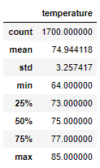
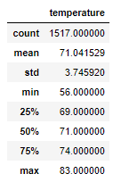
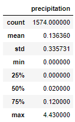
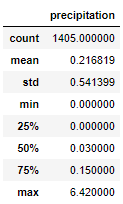
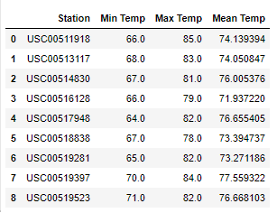
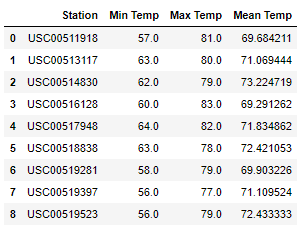
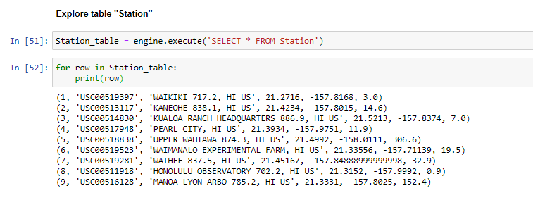

# DABC_surfs_up

## Overview
The purpose of this analysis is to gain insights in the temperature of Oahu to determine if it would be a sustainable business to open a surf and ice cream shop.
The analysis is performed by using Python and jupyter notebook to extract data from a local SQLite database, where the temperature data for Oahu is stored.
By extracting the temperature data for the months of June and December, we are able to gain a statistical overview of the year-round temperature.

## Results

Below tables illustrate the statistical summary of the temperature of Oahu in the months of June and December.

Statistical summary for June

</img>

Statistical summary for December

</img>

- As shown above, the average temperature in June and December range from 71 degrees to 75 degrees, which suggests that the fluctuation between seasons is mild and very suitable for both surfing and having ice cream all year-round.

- In addition, the standard deviation of temperature ranges from 3.26 degrees in June to 3.75 degrees in December. This suggests that the the temperature for both months, on average, are within 4 degrees of the mean.  Indeed, even in December, the temperature is above 69 degrees for at least 75% of the time, which is great for surfing.

- Lastly, for both June and December, the mean and median temperature are extremely close (74.9 and 75 for June; 71.04 and 71 for December). This suggests that the temperature are very evenly distrubuted with very few outliers skewing the temperature to either tails. In other words, "extreme temperatures" like the min of 56 degrees in December and the max of 85 degrees in June are very rare occurances that have close to zero impact on the mean.

## Summary:

- In summary, Oahu appears to be a great choice to open a surf and ice cream shop based on the temperature summary for June and December. The weather is stable all year round at desirable temperature, with very minimal occurances of extreme weather conditions. However, analyzing temperature alone is not sufficient. Let's take a deeper dive into 2 areas: Precipitation, and temperature by station (more specific locations at Oahu)

- As shown in below summary of precipitation for June and December, the variances between the two months are much larger than the variances in temperature. Average precipitation in December (0.2168) is almost twice as much as June (0.1364). However, standard deviation for both June and December are significantly higher than their respective means. This would suggest that precipitation occurances are spreadout and not centered closely around the mean, which makes it more unpredictable. Taking a closer look to compare mean and median, we would notice that the mean is much higher than the median in both months. This suggests that there are more occurances of outliers with high precipitation, skewing the results. By refering to the 75% percentile, we notice that the precipitation is lower than the mean 75% of the time, suggesting that the median is more indicative of the expected level of precipitation. Overall, the level of precipitation is acceptable and generally not a factor that may deter surfers and ice cream lovers.

Precipitation for June

</img>

Precipitation for December

</img>

- Choosing the best location is the key to success. The below summary by station for June and December would be helpful to determine which specific spot is the most suitable location on the island to open shop.

Temperature summary by station for June

</img>

Temperature summary by station for December

</img>

Station locations

</img>
